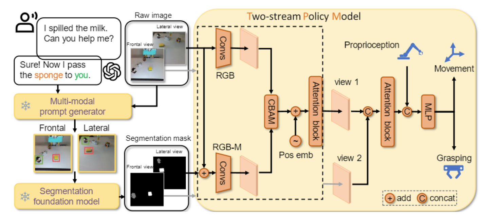

### [WACV 2025 Oral] [Transferring Foundation Models for Generalizable Robotic Manipulation](https://arxiv.org/pdf/2306.05716)
### [Arxiv 23.06] [Pave the Way to Grasp Anything: Transferring Foundation Models for Universal Pick-Place Robots](https://arxiv.org/abs/2306.05716v1)
[](https://www.youtube.com/watch?v=MAcUPFBfRIw)&nbsp;&nbsp;&nbsp;&nbsp;[](https://www.youtube.com/watch?v=1m9wNzfp_4E&t=1s)&nbsp;&nbsp;&nbsp;&nbsp; <a href="https://www.bilibili.com/video/BV178411Z7H2/?spm_id_from=333.337.search-card.all.click&vd_source=6ef02624a258fc3bb2d549db99686bc9"></a>




## Getting started

### Preparation:
- Install ROS Noetic and [Movelt](https://github.com/moveit/moveit)

- Clone GroundingDINO for open-vocab object detection
`git clone https://github.com/IDEA-Research/GroundingDINO.git`

- Clone MixFormer for object tracking:
`git clone https://github.com/MCG-NJU/MixFormer.git`

- Clone Segment-Anything for segmentation:
`https://github.com/facebookresearch/segment-anything.git`

- Prepare and process your own data

### Train the model:

- Prepare the the environment
`
conda env create -f environment.yaml
`

- Train our two-stream policy
`
python train.py
`

### Inference our two-stream policy on a Franka robot:

- Run inference
`
python inference/inference.py
`

## Citation
Please cite the following paper if you feel this repository useful for your research.
```
@article{yang2023transferring,
  title={Transferring foundation models for generalizable robotic manipulation},
  author={Yang, Jiange and Tan, Wenhui and Jin, Chuhao and Yao, Keling and Liu, Bei and Fu, Jianlong and Song, Ruihua and Wu, Gangshan and Wang, Limin},
  journal={arXiv preprint arXiv:2306.05716},
  year={2023}
}

@article{yang2023pave,
  title={Pave the way to grasp anything: Transferring foundation models for universal pick-place robots},
  author={Yang, Jiange and Tan, Wenhui and Jin, Chuhao and Liu, Bei and Fu, Jianlong and Song, Ruihua and Wang, Limin},
  journal={arXiv preprint arXiv:2306.05716},
  volume={1},
  number={2},
  year={2023}
}
```
## Acknowledges
[Movelt](https://github.com/moveit/moveit)

[GroundingDINO](https://github.com/IDEA-Research/GroundingDINO) 

[Mixfromer](https://github.com/MCG-NJU/MixFormer)  [MixformerV2](https://github.com/MCG-NJU/MixFormerV2) 

[SAM](https://github.com/facebookresearch/segment-anything) [MobileSAM](https://github.com/ChaoningZhang/MobileSAM)

[MiniGPT-4](https://github.com/Vision-CAIR/MiniGPT-4) [DetGPT](https://github.com/OptimalScale/DetGPT)
